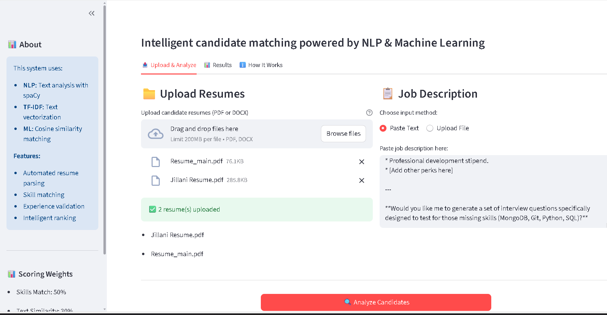
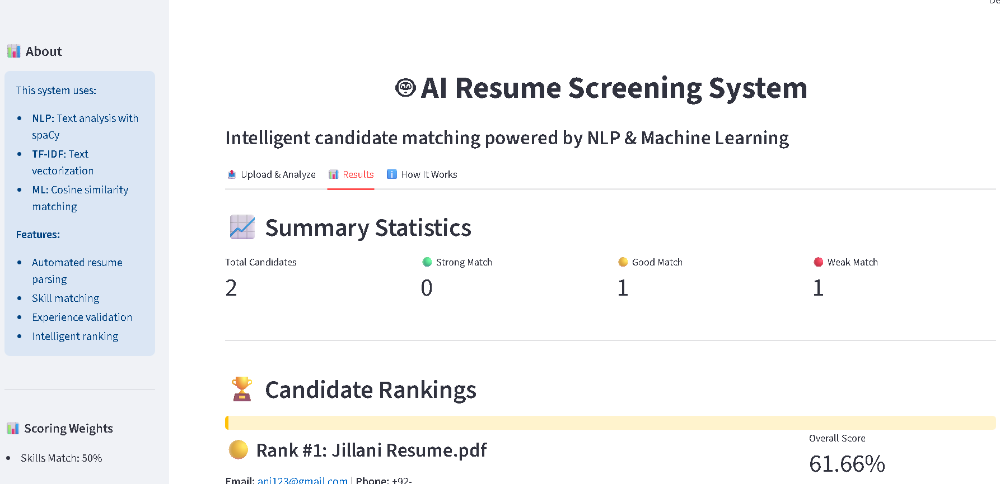

# AI Resume Screening & Candidate Matching System

An intelligent NLP-based system that automatically screens resumes, matches candidates with job descriptions, and ranks them based on skills, experience, and relevance.


##  Project Overview

This system automates the resume screening process using Natural Language Processing and Machine Learning techniques. It helps recruiters save 70%+ time by automatically ranking candidates based on:
- **Skills Match**: Compares candidate skills with job requirements
- **Text Similarity**: Uses TF-IDF vectorization and cosine similarity
- **Experience Match**: Validates years of experience against requirements
- 
##  Features

   **Resume Parsing**: Extracts structured data from PDF/DOCX resumes
   **Intelligent Matching**: NLP-based similarity scoring using TF-IDF
   **Candidate Ranking**: Automatically ranks all candidates by fit
   **Detailed Analytics**: Skill gap analysis and match breakdowns
   **Export Results**: Generates CSV and JSON reports
   **Batch Processing**: Process multiple resumes at once


## Tech Stack

- **Language**: Python 3.8+
- **NLP**: spaCy, TF-IDF Vectorization
- **ML**: scikit-learn (Cosine Similarity)
- **Data Processing**: pandas, numpy
- **PDF/DOCX Parsing**: PyPDF2, python-docx
- **Regex**: Advanced pattern matching for information extraction

---

##  Requirements
```
python >= 3.8
spacy >= 3.0
scikit-learn >= 1.0
pandas >= 1.3
numpy >= 1.21
PyPDF2 >= 3.0
python-docx >= 0.8
```

---

##  Installation & Setup

### 1. Clone the repository
```bash
git clone https://github.com/YOUR_USERNAME/ai-resume-screening.git
cd ai-resume-screening
```

### 2. Create virtual environment
```bash
python -m venv venv

# Activate on Windows
venv\Scripts\activate

# Activate on Mac/Linux
source venv/bin/activate
```

### 3. Install dependencies
```bash
pip install -r requirements.txt
python -m spacy download en_core_web_sm
```

### 4. Setup data directories
```bash
mkdir -p data/resumes data/job_descriptions
```

### 5. Add your data
- Place resume files (PDF/DOCX) in `data/resumes/`
- Place job description files (.txt) in `data/job_descriptions/`

---

##  Usage

### Quick Start - Test Single Candidate
```bash
python matcher.py
```

### Rank All Candidates
```bash
python rank_candidates.py
```

### Test Individual Components
```bash
# Test resume parser
python resume_parser.py

# Test text vectorization
python text_vectorizer.py
```

---

##  Sample Output
CANDIDATE RANKINGS - SORTED BY SCORE
 
RANK #1 | Overall Score: 82.5% | john-doe-resume.pdf

 john@email.com |  +1-555-1234
 Masters |  5 years experience

 Score Breakdown:
   • Skills Match:     85%
   • Text Similarity:  78%
   • Experience Match: 100%

 Has Required Skills (8):
   python, machine learning, tensorflow, docker, aws, sql, git, agile

 Missing Skills (2):
   kubernetes, react


##  Project Structure
```
ai-resume-screening/
├── data/
│   ├── resumes/              # Place resume files here
│   └── job_descriptions/     # Place JD files here
├── resume_parser.py          # Resume parsing module
├── job_description_parser.py # JD parsing module
├── text_vectorizer.py        # TF-IDF vectorization
├── matcher.py                # Candidate matching algorithm
├── rank_candidates.py        # Main ranking system
├── requirements.txt          # Python dependencies
├── .gitignore               # Git ignore rules
└── README.md                # Project documentation
```


##  How It Works

### 1. **Resume Parsing**
- Extracts text from PDF/DOCX files
- Uses regex to extract contact info (email, phone)
- Identifies skills using keyword matching
- Calculates years of experience
- Determines education level

### 2. **Text Vectorization**
- Preprocesses text (lowercasing, removing stopwords)
- Creates TF-IDF vectors with unigrams and bigrams
- Limits vocabulary to top 5000 features

### 3. **Similarity Calculation**
- Computes cosine similarity between resume and JD vectors
- Returns percentage match (0-100%)

### 4. **Overall Scoring**
- **Skills Match (50% weight)**: Percentage of required skills found
- **Text Similarity (30% weight)**: TF-IDF cosine similarity
- **Experience Match (20% weight)**: Years of experience comparison

### 5. **Ranking & Recommendations**
- Sorts candidates by overall score
- Provides hiring recommendations:
  -  75%+ = Strong Match (Schedule Interview)
  -  60-74% = Good Match (Review Carefully)
  -  40-59% = Possible Match (Consider for Junior)
  -  <40% = Weak Match (Not Recommended)


# 🤖 AI Resume Screening System

Live Demo: https://shanvi0708-parser-pro-app-o9dkca.streamlit.app/

## Features
- Upload multiple resumes (PDF/DOCX)
- AI-powered candidate matching
- Intelligent ranking system
- Download results as CSV

## Tech Stack
- Python, spaCy, scikit-learn
- TF-IDF, NLP, Machine Learning
- Streamlit for web interface

##  Future Enhancements
- [ ] Advanced ML classification (hire/no-hire prediction)
- [ ] BERT embeddings for better semantic matching
- [ ] Email notification system
- [ ] PDF report generation
- [ ] Multi-language support
- [ ] Integration with ATS systems

Below is a sample output generated by the system after ranking candidates based on resume–JD matching:

### Screenshot 1: Upload & Analysis Interface


### Screenshot 2: Candidate Rankings & Results

##  Contributing
Contributions are welcome! Please feel free to submit a Pull Request.
##  License
This project is open source and available under the MIT License.
## Author

**SHANVI SHARMA**
- GitHub:  [@Shanvi0708](https://github.com/Shanvi0708)
- LinkedIn: [Shanvi Sharma](https://www.linkedin.com/in/shanvisharma)
- Email: shanvisharma@gmail.com

##  Acknowledgments

- Built as a portfolio project to demonstrate NLP and ML skills
- Inspired by real-world HR tech challenges
- Uses industry-standard libraries and best practices

##  Show Your Support

Give a ⭐️ if this project helped you!

**Made with ❤️ and Python**
